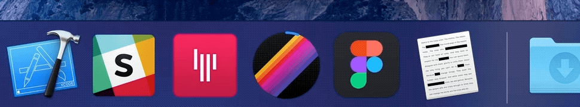
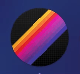

# DockProgress

> Show progress in your app's Dock icon



This package is used in production by the [Gifski app](https://github.com/sindresorhus/gifski-app).


## Requirements

- macOS 10.12+
- Xcode 9+
- Swift 4+


## Install

With [SPM](https://swift.org/package-manager/):

```swift
.package(url: "https://github.com/sindresorhus/DockProgress", from: "1.0.0")
```

With [Carthage](https://swift.org/package-manager/):

```
github "sindresorhus/DockProgress"
```


## Usage

### Manually set the progress

```swift
import Cocoa
import DockProgress

foo.onUpdate = { progress
	DockProgress.progressValue = progress
}
```

### Specify a [`Progress`](https://developer.apple.com/documentation/foundation/progress) instance

```swift
import Cocoa
import DockProgress

let progress = Progress(totalUnitCount: 1)
progress?.becomeCurrent(withPendingUnitCount: 1)

DockProgress.progress = progress
```


## Styles

It comes with two styles. PR welcome for more.

You can also draw a custom progress with `.custom(drawHandler: (_ rect: CGRect) -> Void)`.

### Bar



```swift
import DockProgress

DockProgress.style = .bar
```

This is the default.

### Circle


```swift
import DockProgress

DockProgress.style = .circle(radius: 55, color: .systemBlue)
```

Make sure to set a `radius` that matches your app icon.


## Related

- [LaunchAtLogin](https://github.com/sindresorhus/LaunchAtLogin) - Add "Launch at Login" functionality to your macOS app


## License

MIT © [Sindre Sorhus](https://sindresorhus.com)
