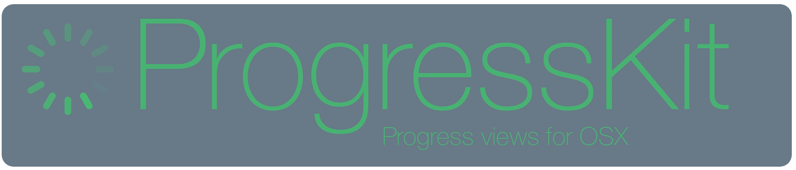
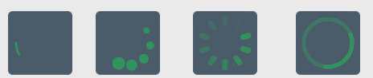
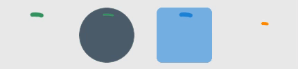
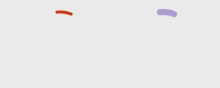
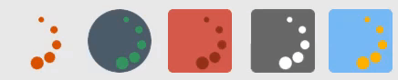
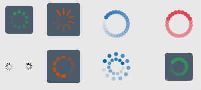
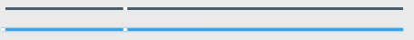
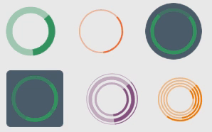
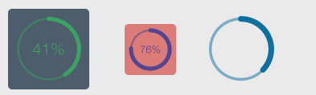
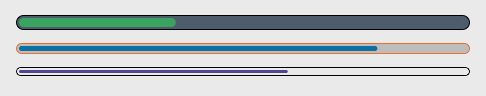

[](https://img.shields.io/cocoapods/v/ProgressKit.svg)
[](http://cocoadocs.org/docsets/ProgressKit)
[](http://cocoadocs.org/docsets/ProgressKit)


`ProgressKit` has set of cool `IBDesignable` progress views, with huge customisation options. 
You can now make spinners, progress bar, crawlers etc, which can be finely customised according to your app palette.

# Contents
- [Installation](#installation)
- [Usage](#usage)
- [Indeterminate Progress](#indeterminate-progress)
  - [MaterialProgress](#MaterialProgress)
  - [Rainbow](#rainbow)
  - [Crawler](#crawler)
  - [Spinner](#spinner)
  - [Shooting Stars](#shooting-stars)
  - [Rotating Arc](#rotating-arc)
- [Determinate Progress](#determinate-progress)
  - [Circular Progress] (#circular-progress)
  - [Progress Bar](#progress-bar)
- [License](#license)

# Minimum Requirments

``` macOS 10.10 or later. ```

# Installation
##CocoaPods
[CocoaPods](http://cocoapods.org) adds supports for Swift and embedded frameworks.

To integrate ProgressKit into your Xcode project using CocoaPods, specify it in your `Podfile`:

```ruby
use_frameworks!

pod 'ProgressKit'
```
For Swift 3 install directly from `swift-3` branch form github

```ruby
pod 'ProgressKit', :git => "https://github.com/kaunteya/ProgressKit.git", :branch => 'swift-3'
```

Then, run the following command:

```bash
$ pod install
```

##Carthage

add to your ```Cartfile``` :

``` github kaunteya/ProgressKit ```

##Swift Package Manager

add to ``` Package.swift``` :

```
import PackageDescription

let package = Package(
    name: "myProject",
    dependencies: [
        .Package(url: "https://github.com/kaunteya/ProgressKit.git", majorVersion: 0, minor: 5)
    ])
```

  
# Usage
- Drag  a View at desired location in `XIB` or `Storyboard`
- Change the Class to any of the desired progress views
- Set the size such that width and height are equal
- Drag `IBOutlet` to View Controller
- For `Indeterminate` Progress Views
  - Set `true / false` to `view.animate`
- For `Determinate` Progress Views:
  - Set `view.progress` to value in `0...1`
  

# Indeterminate Progress

  
Progress indicators which animate indefinately are `Indeterminate Progress` Views.

This are the set of Indeterminate Progress Indicators.

## MaterialProgress


## Rainbow

## Crawler


## Spinner


## Shooting Stars


## Rotating Arc


# Determinate Progress
Determinate progress views can be used for tasks whos progress can be seen and determined.

## Circular Progress


## Progress Bar


# License
`ProgressKit` is released under the MIT license. See LICENSE for details.

