# How to Create a Gifski Quick Action Shortcut

This is a step-by-step guide on how to create a Quick Action shortcut in the Shortcuts app to convert videos to GIFs using Gifski.

In the end you'll have a quick action that lets you quickly convert videos to GIFs like this:

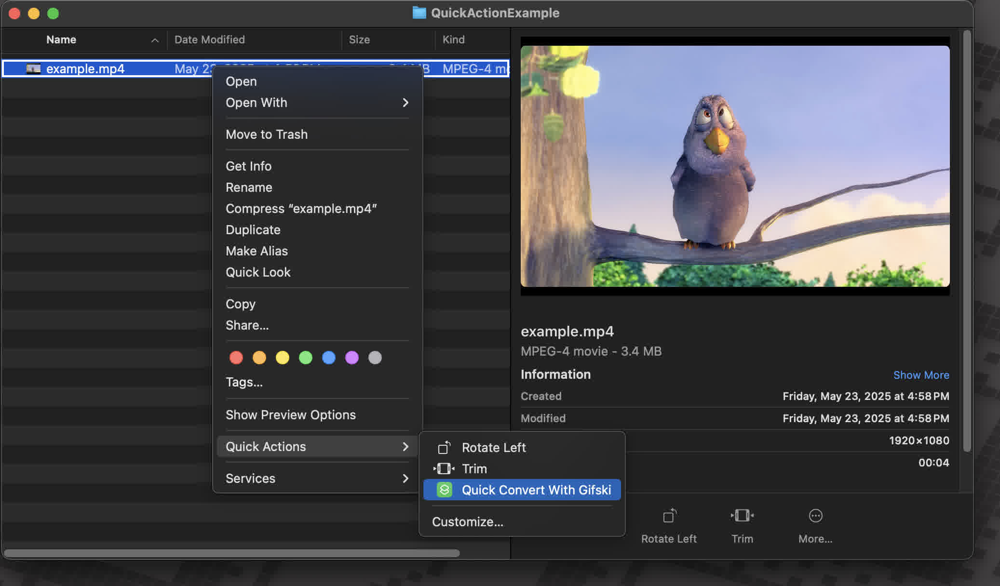

or this:

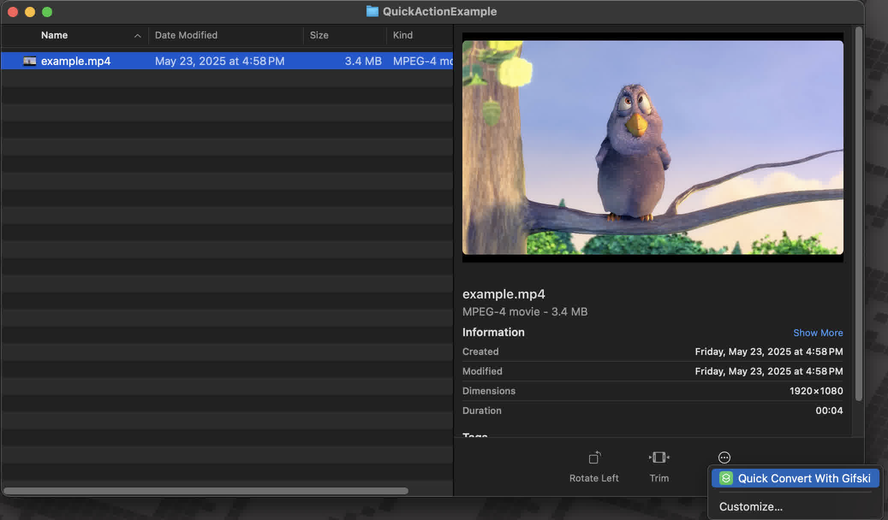

## Video Guide
Before we go step by step, if you prefer a video guide, you can watch the following video that demonstrates how to create a Quick Convert Action in the Shortcuts app:

https://github.com/user-attachments/assets/31f825ca-825f-4686-b23a-db6fc3478545

### Step-by-Step Guide

## Step 1: Open the Shortcuts App
Open the Shortcuts app on your Mac. You can find it in the Applications folder or by searching for "Shortcuts" using Spotlight (Cmd + Space).

If you have any other questions about the Shortcuts app, you can refer to the official [Shortcuts for Mac User Guide](https://support.apple.com/guide/shortcuts-mac/welcome/mac)

## Step 2: Create a New Shortcut
- Click on the "+" button in the top right corner to create a new shortcut.
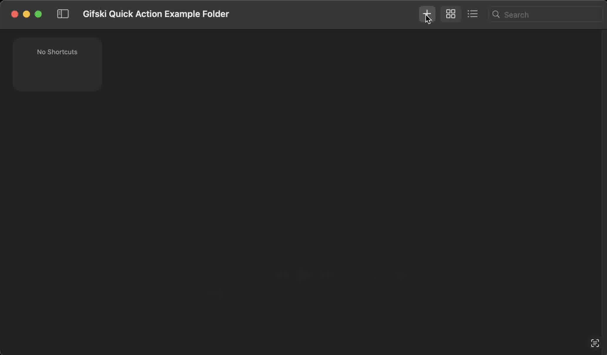

## Step 3: Change the Shortcut Name (Optional)
- Click on the name of the shortcut at the top and change it to something like "Convert Video to GIF" or any name you prefer.
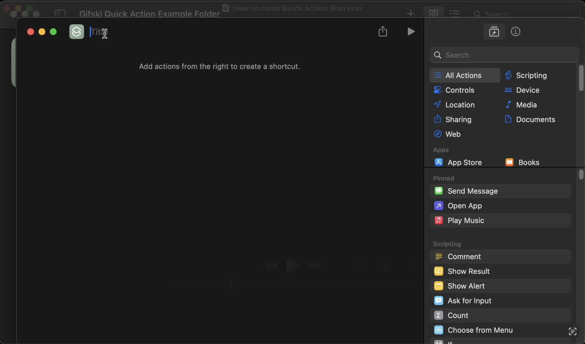

## Step 4: Add the Quick Action Input
- In the right sidebar, click on the "Shortcut Details" button (the one with an i inside a circle).
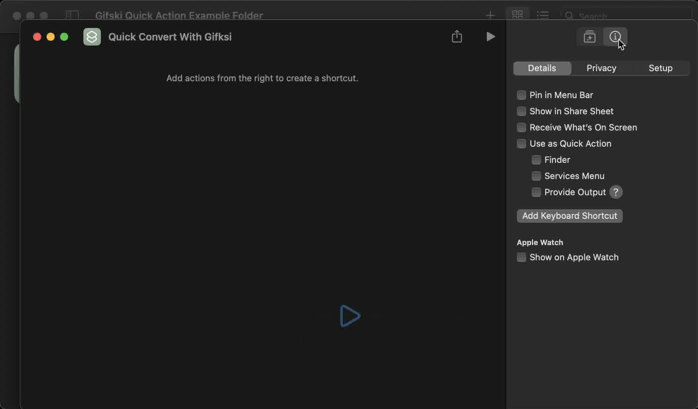

Then check the following
- **Use as Quick Action**: This will allow you to use this shortcut as a Quick Action.
- **Finder**: This will make the shortcut available in Finder.
- **Services Menu**: This will make the shortcut available in the Services menu.
- **Provide Output**: This will allow the shortcut to save the output of the conversion.

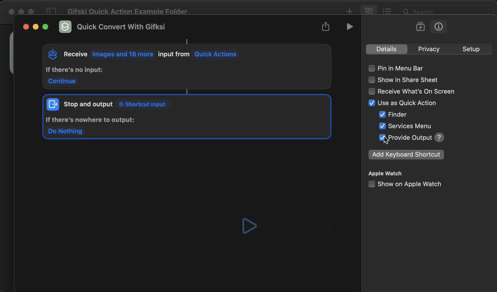

## Step 5: Change the Input Type
- You should now see a section called Receive `Images and 18 more` from `Quick Action`.
- Click on `Images and 18 more`, and change it so that only `Media` is selected. This will ensure that the shortcut only accepts media files (videos).

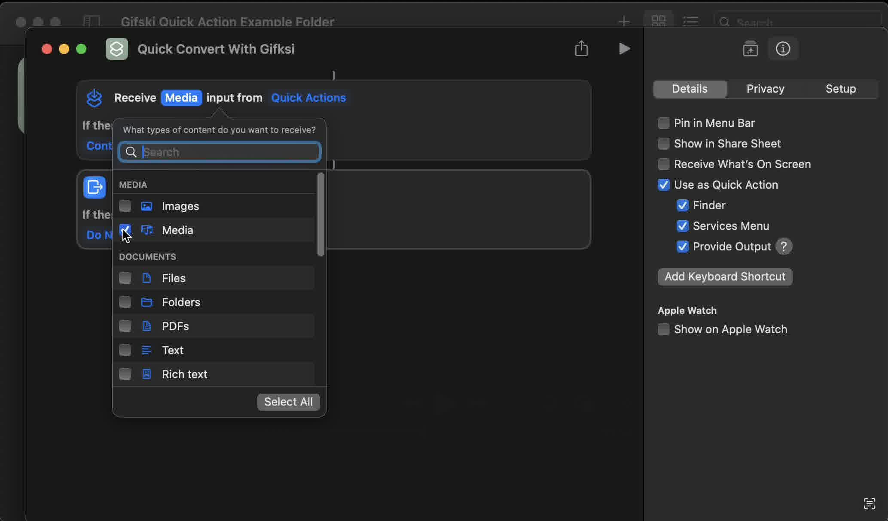

## Step 6: Ask for Files (Optional)
- Where it says `If there is no input` `Continue`, click on `Continue` and change it to `Ask For`.
- Then click on `Photos` and change it to `Files`.
This will allow you to select files to convert if you ever run the Shortcut outside of Finder.

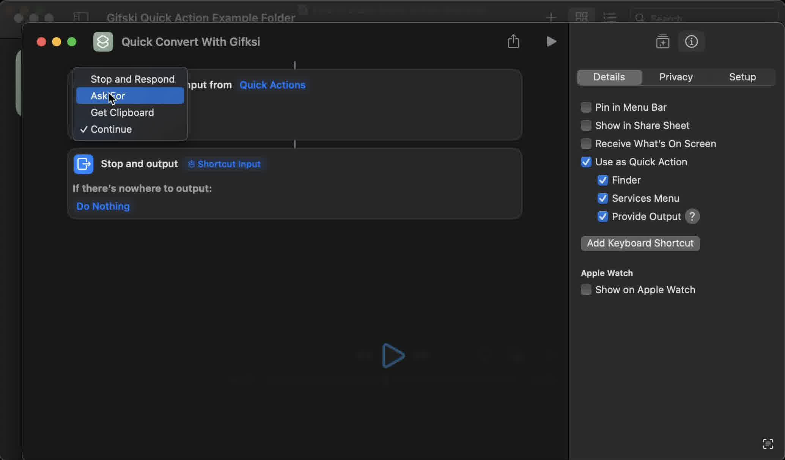

- In the right sidebar, click on the `Action Library` button (the one with the stars in a rounded rectangle).
- Then type in `gifski` and `Convert Video to Animated Gif` should appear.
- Drag the `Convert Video to Animated Gif` action into your shortcut, right below the `Ask For` action if you added it, and above the `Stop and Output` action.

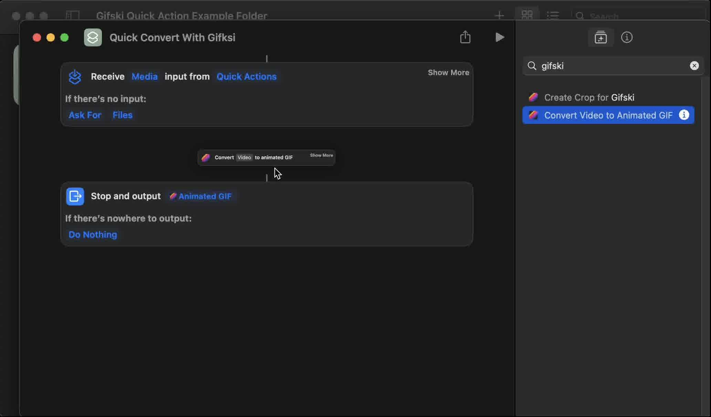

## Step 8: Change `Video` to `Shortcut Input`
- In the `Convert Video to Animated Gif` action, click on the `Video` field and change it to `Shortcut Input`. This will ensure that the shortcut uses the input from the Quick Action.

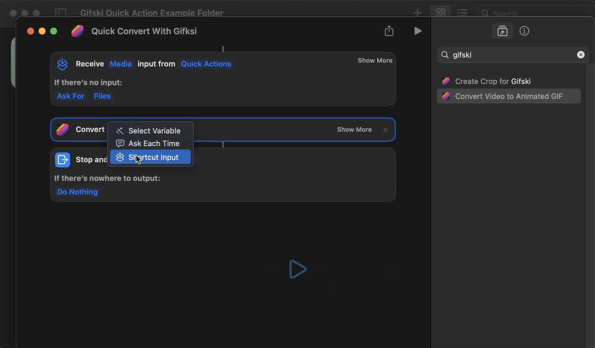

## Step 9: Adjust your GIF Settings (Optional)
- You can adjust the settings for the GIF conversion in the `Convert Video to Animated Gif` action. You can change the crop, frame rate, and other settings to your liking.
- Just click on the `Show more` button in the `Convert Shortcut Input to Animated Gif` action to see all the options available.

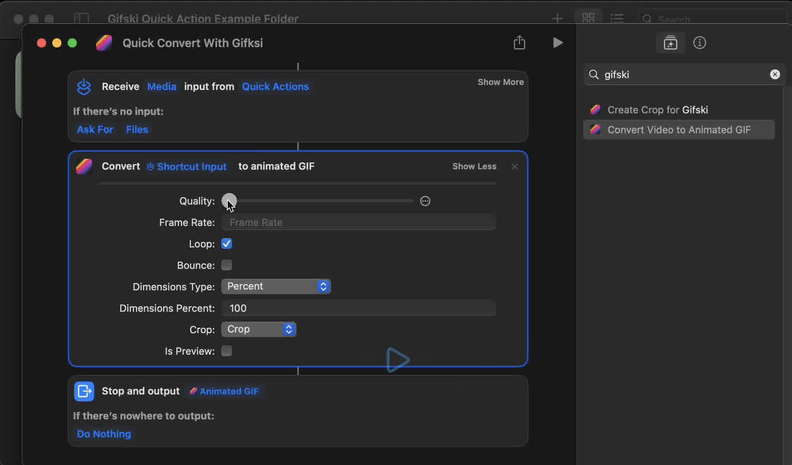

## Step 10: Change the Output Behavior (Optional)
- By default, if there is nowhere to save the GIF, it will do nothing.
- Click on the `Do Nothing` button in the `Stop and Output Animated Gif` action and change it to `Respond`.
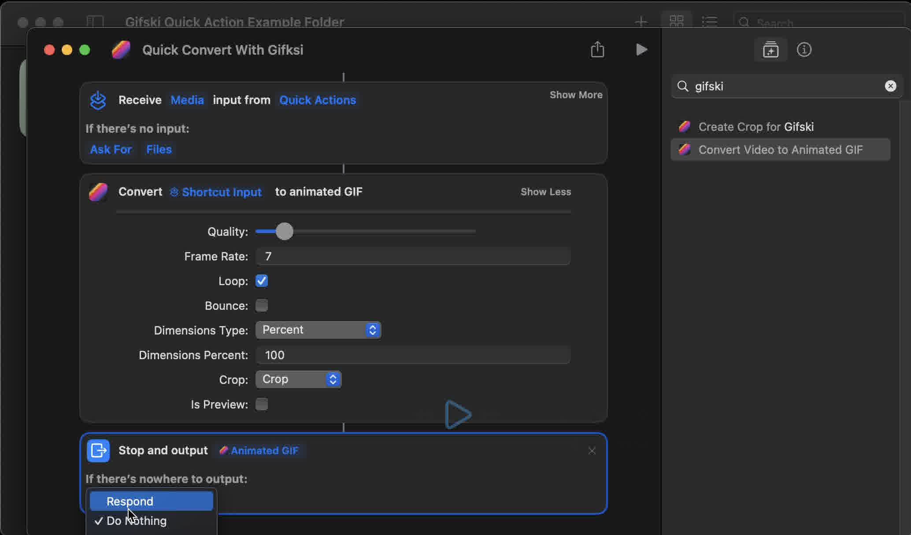

### All done!
You should now have a Quick Action shortcut that converts videos to GIFs using Gifski. Your final shortcut should look something like this:

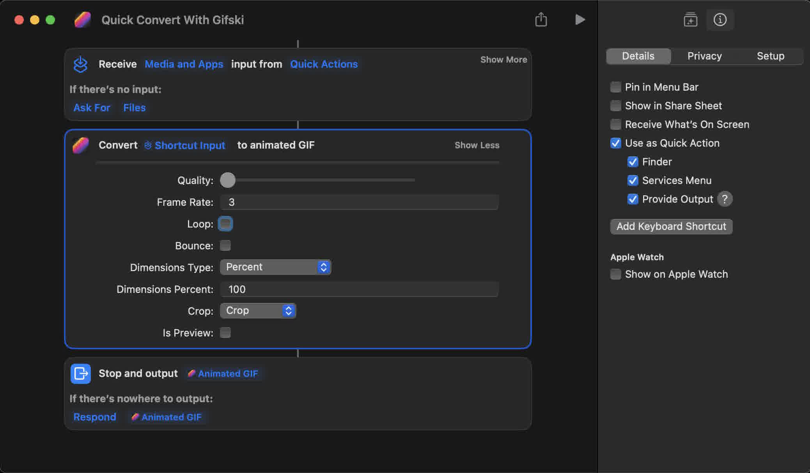

