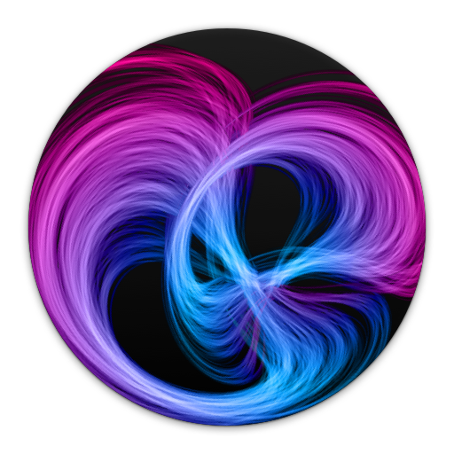
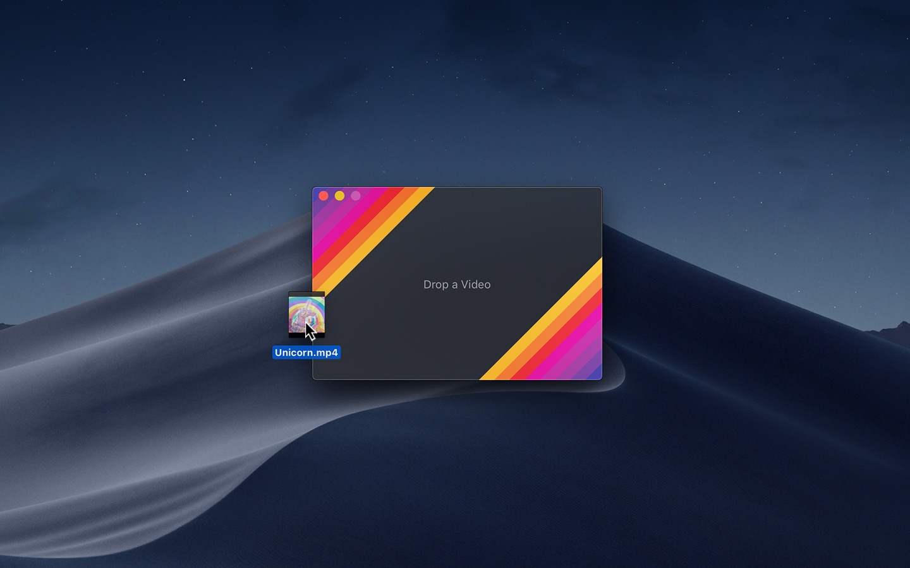
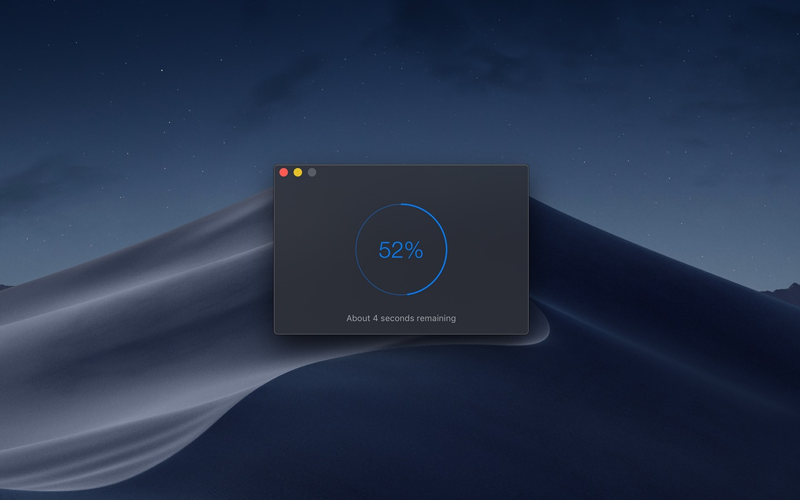
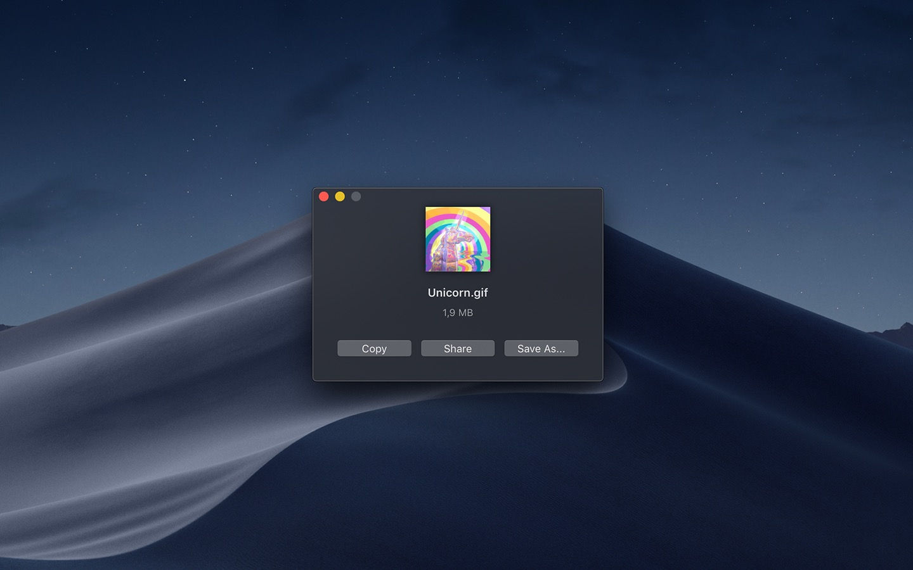

<div align="center">
	
	<h1>Gifski</h1>
	<p>
		<b>Convert videos to high-quality GIFs on your Mac</b>
	</p>
	<br>
	<br>
	<br>
</div>

This is a macOS app for the [`gifski` encoder](https://gif.ski), which converts videos to GIF animations using [`pngquant`](https://pngquant.org)'s fancy features for efficient cross-frame palettes and temporal dithering. It produces animated GIFs that use thousands of colors per frame and up to 50 FPS (useful for showing off design work on Dribbble).

You can also produce smaller lower quality GIFs when needed with the “Quality” slider, thanks to [`gifsicle`](https://github.com/kohler/gifsicle).

Gifski supports all the video formats that macOS supports (`.mp4` or `.mov` with H264, HEVC, ProRes, etc). The [QuickTime Animation format](https://en.wikipedia.org/wiki/QuickTime_Animation) is not supported. Use [ProRes 4444 XQ](https://en.wikipedia.org/wiki/Apple_ProRes) instead. It's more efficient, more widely supported, and like QuickTime Animation, it also supports alpha channel.

**[Blog post](https://blog.sindresorhus.com/gifski-972692460aa5)** &nbsp;&nbsp; **[Product Hunt](https://www.producthunt.com/posts/gifski-2)**

## Download

[](https://apps.apple.com/app/id1351639930)

Requires macOS 10.15 or later.

#### Older versions

- [Last macOS 10.14 compatible version](https://github.com/sindresorhus/Gifski/releases/download/v2.16.0/Gifski.2.16.0.-.macOS.10.14.zip) *(Gifski 2.16.0)*
- [Last macOS 10.13 compatible version](https://github.com/sindresorhus/Gifski/files/3991913/Gifski.2.4.0.-.High.Sierra.zip) *(Gifski 2.4.0)*

## Features

### Share extension

Gifski includes a share extension that lets you share videos to Gifski. Just select Gifski from the Share menu of any macOS app.

> Tip: You can share a macOS screen recording with Gifski by clicking on the thumbnail that pops up once you are done recording and selecting “Share” from there.

### System service

Gifski includes a [system service](https://www.computerworld.com/article/2476298/os-x-a-quick-guide-to-services-on-your-mac.html) that lets you quickly convert a video to GIF from the **Services** menu in any app that provides a compatible video file.

### Bounce (yo-yo) GIF playback

Gifski includes the option to create GIFs that bounce back and forth between forward and backward playback. This is a similar effect to the bounce effect in [iOS's Live Photo effects](https://support.apple.com/en-us/HT207310). This option doubles the number of frames in the GIF so the file size will double as well.

## Tips

#### Quickly copy or save the GIF

After converting, press <kbd>Command+C</kbd> to copy the GIF or <kbd>Command+S</kbd> to save it.

#### Change GIF dimensions with the keyboard


In the width/height input fields in the editor view, press the arrow up/down keys to change the value by 1. Hold the Option key meanwhile to change it by 10.

## Screenshots






## Building from source

To build the app in Xcode, you need to have [Rust](https://www.rust-lang.org) and GCC 10 installed first:

```sh
curl https://sh.rustup.rs -sSf | sh
brew install gcc SwiftLint
xcode-select --install
cd gifski-api && make
```

## FAQ

#### The generated GIFs are huge!

The GIF image format is very space inefficient. It works best with short video clips. Try reducing the dimensions, FPS, or quality.

#### Why are 60 FPS and higher not supported?

Browsers throttle frame rates above 50 FPS, playing them at 10 FPS. [Read more](https://github.com/sindresorhus/Gifski/issues/161#issuecomment-552547771).

#### How can I convert a sequence of PNG images to a GIF?

Install [FFmpeg](https://www.ffmpeg.org/) (with Homebrew: `brew install ffmpeg`) and then run this command:

```
TMPFILE="$(mktemp /tmp/XXXXXXXXXXX).mov"; \
	ffmpeg -f image2 -framerate 30 -i image_%06d.png -c:v prores_ks -profile:v 5 "$TMPFILE" \
	&& open -a Gifski "$TMPFILE"
```

Ensure the images are named in the format `image_000001.png` and adjust the `-framerate` accordingly.

[*Command explanation.*](https://avpres.net/FFmpeg/sq_ProRes.html)

#### How can I run multiple conversions at the same time?

This is unfortunately not supported. However, if you know how to run a terminal command, you could run `open -na Gifski` multiple times to open multiple instances of Gifski, where each instance can convert a separate video. You should not have the editor view open in multiple instances though, as changing the quality, for example, will change it in all the instances.

#### Can I contribute localizations?

We don't have any immediate plans to localize the app.

#### Can you support Windows/Linux?

No, but there's a [cross-platform command-line tool](https://github.com/ImageOptim/gifski) available.

## Press

- [Five Mac Apps Worth Checking Out - September 2019 - MacRumors](https://www.macrumors.com/2019/09/04/five-mac-apps-sept-2019/)

## Built with

- [gifski library](https://github.com/ImageOptim/gifski) - High-quality GIF encoder
- [Defaults](https://github.com/sindresorhus/Defaults) - Swifty and modern UserDefaults
- [CircularProgress](https://github.com/sindresorhus/CircularProgress) - Circular progress indicator for your macOS app
- [DockProgress](https://github.com/sindresorhus/DockProgress) - Show progress in your app's Dock icon

## Maintainers

- [Sindre Sorhus](https://github.com/sindresorhus)
- [Kornel Lesiński](https://github.com/kornelski)
- [Lars-Jørgen Kristiansen](https://github.com/LarsJK)
- [Boy van Amstel](https://github.com/boyvanamstel)
- [Łukasz Mróz](https://github.com/sunshinejr)

## Related

- [Sindre's apps](https://sindresorhus.com/apps)

## License

MIT (the Mac app) + [gifski library license](https://github.com/ImageOptim/gifski/blob/master/LICENSE)
